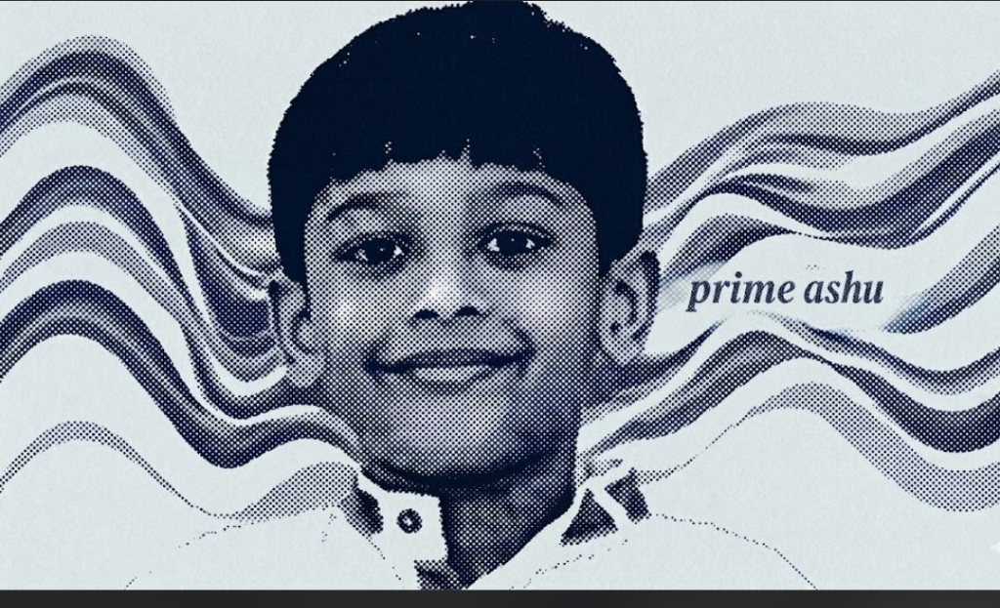

  

# Atharve Dahima

  
  
  

---

### Overview

I build at the intersection of **silicon photonics, optical wireless systems (LiFi), autonomous avionics, and embedded engineering**.

- **Quantum Photonics & Linear Optics:** Compiling quantum circuits to physical Mach-Zehnder meshes, thermal cross-talk matrix inversion ($K^{-1}$), and 220nm cleanroom noise modeling.
- **Laser & Optical Communications (Li-Fi):** Modeling free-space optical (FSO) networks, Digital Micromirror Device (DMD) beam steering, and high-bandwidth optical transmission.
- **Avionics & Robotics:** Designing and tuning autonomous multirotors using Pixhawk and ArduPilot stacks.
- **Embedded Systems & Edge Vision:** Deploying computer vision pipelines on resource-constrained compute (Raspberry Pi and microcontrollers).

---

### Technical Stack

<table align="center" width="100%">
  <tr>
    <td width="50%" valign="top">
      <h4>Photonics & Quantum</h4>
      
      
      
       
      
      
      
    </td>
    <td width="50%" valign="top">
      <h4>Languages & Computing</h4>
      
      
      
      
       
      
      
      
    </td>
  </tr>
  <tr>
    <td width="50%" valign="top">
      <h4>Avionics & Hardware</h4>
      
      
      
       
      
      
      
    </td>
    <td width="50%" valign="top">
      <h4>Tools & Development</h4>
      
      
      
       
      
      
      
    </td>
  </tr>
</table>

---

### Featured Projects

#### [qfoton](https://github.com/atharveeee-netizen/qfoton)
> **Full-Stack Silicon Photonic Quantum Computing & Compiler Suite**
- Compiles standard OpenQASM circuits into balanced Clements Mach-Zehnder meshes with 3D Quantum State Tomography (Re[ρ]).
- Inverts inter-heater thermal diffusion ($K^{-1}$), eliminating 18% thermal bleeding to restore state fidelity to 100%.
- Reproduces landmark Carolan et al. *Science* (2015) 6-mode silicon chip benchmarks within 0.05% fidelity.
- `Silicon Photonics` • `OpenQASM` • `Clements SU(N)` • `MATLAB / Simulink` • `Python` • `GDSII CAD`

#### [laser-lifi-network](https://github.com/atharveeee-netizen/laser-lifi-network)
> **Laser-Based Indoor LiFi Network with DMD Beam Steering**
- Modeled and simulated indoor high-bandwidth Free-Space Optical Communications (FSO / LiFi).
- Coupled COMSOL Multiphysics for Digital Micromirror Device (DMD) optical beam steering with OptiSystem transmission metrics.
- `Optical Wireless` • `Laser LiFi` • `COMSOL` • `OptiSystem` • `MATLAB` • `Beam Steering`

#### [f450-face-detection-drone](https://github.com/atharveeee-netizen/f450-face-detection-drone)
> **Autonomous Multirotor with Companion Edge Computer Vision**
- Built F450 quadcopter platform integrated with Pixhawk flight controller, GPS lock, and LiPo power distribution.
- Deployed onboard real-time OpenCV detection running on a companion Raspberry Pi interfaced over MAVLink.
- `Pixhawk` • `ArduPilot` • `Raspberry Pi` • `OpenCV` • `Python` • `MAVLink`

---

### GitHub Activity

  
  

---

  Atharve Dahima • Embedded Systems, Photonics & Robotics

